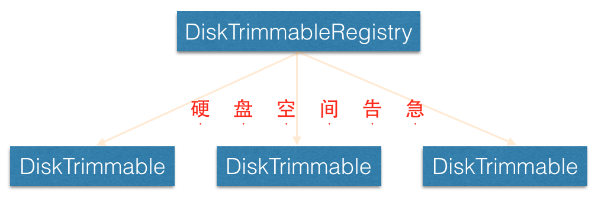

*这部分代码位于 com.facebook.common.disk*

`DiskTrimmable` 和 `DiskTrimmableRegistry` 都是接口，两者关系如上图所示，是一个典型的观察者模型。

```java
/**
 * Any class that uses a lot of disk space and should implement this interface.
 */
public interface DiskTrimmable {
  /**
   * Called when there is very little disk space left.
   */
  void trimToMinimum();

  /**
   * Called when there is almost no disk space left and the app is likely to crash soon
   */
  void trimToNothing();
}
```

任何一个使用了大量硬盘空间的类都应该实现 `DiskTrimmable` 接口，然后注册到 `DiskTrimmableRegistry`，当硬盘容量告急时， `DiskTrimmable#trimToMinimum` 或 `DiskTrimmable#trimToNothing` 就会被调用。

```java
/**
 * A class which keeps a list of other classes to be notified of system disk events.
 *
 * <p>If a class uses a lot of disk space and needs these notices from the system, it should
 * implement the {@link DiskTrimmable} interface.
 *
 * <p>Implementations of this class should notify all the trimmables that have registered with it
 * when they need to trim their disk usage.
 */
public interface DiskTrimmableRegistry {

  /** Register an object. */
  void registerDiskTrimmable(DiskTrimmable trimmable);

  /** Unregister an object. */
  void unregisterDiskTrimmable(DiskTrimmable trimmable);
}
```

源码中还定义了一个不做任何操作的 `DiskTrimmableRegistry` - `NoOpDiskTrimmableRegistry`，应该会被用来做默认值。

```java
/**
 * Implementation of {@link DiskTrimmableRegistry} that does not do anything.
 */
public class NoOpDiskTrimmableRegistry implements DiskTrimmableRegistry {
  private static NoOpDiskTrimmableRegistry sInstance = null;

  private NoOpDiskTrimmableRegistry() {
  }

  public static synchronized NoOpDiskTrimmableRegistry getInstance() {
    if (sInstance == null) {
      sInstance = new NoOpDiskTrimmableRegistry();
    }
    return sInstance;
  }

  @Override
  public void registerDiskTrimmable(DiskTrimmable trimmable) {
  }

  @Override
  public void unregisterDiskTrimmable(DiskTrimmable trimmable) {
  }
}
```
